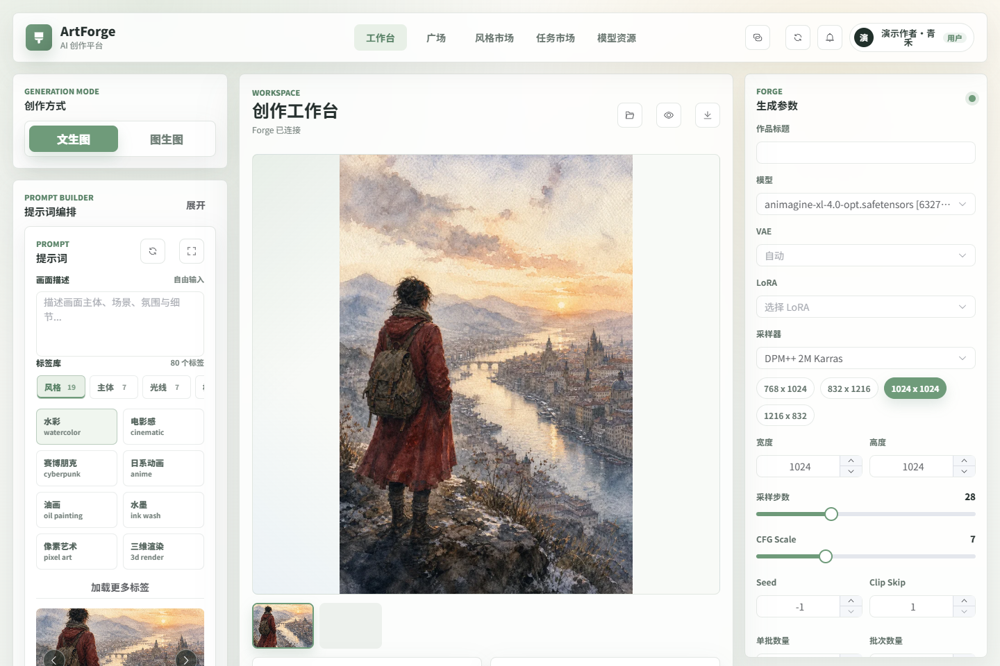
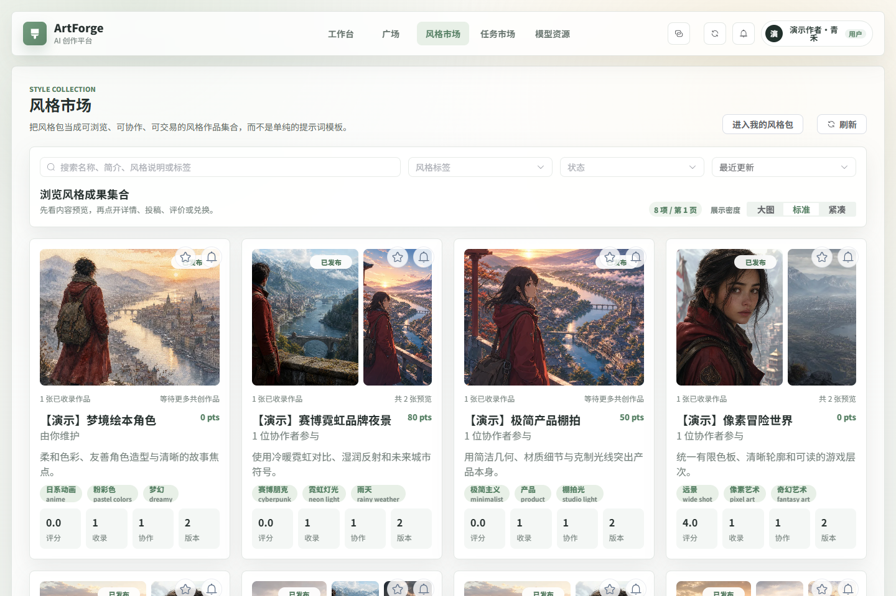
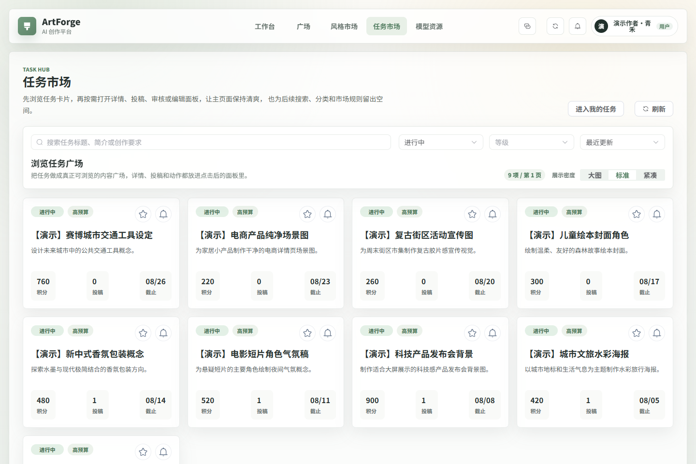
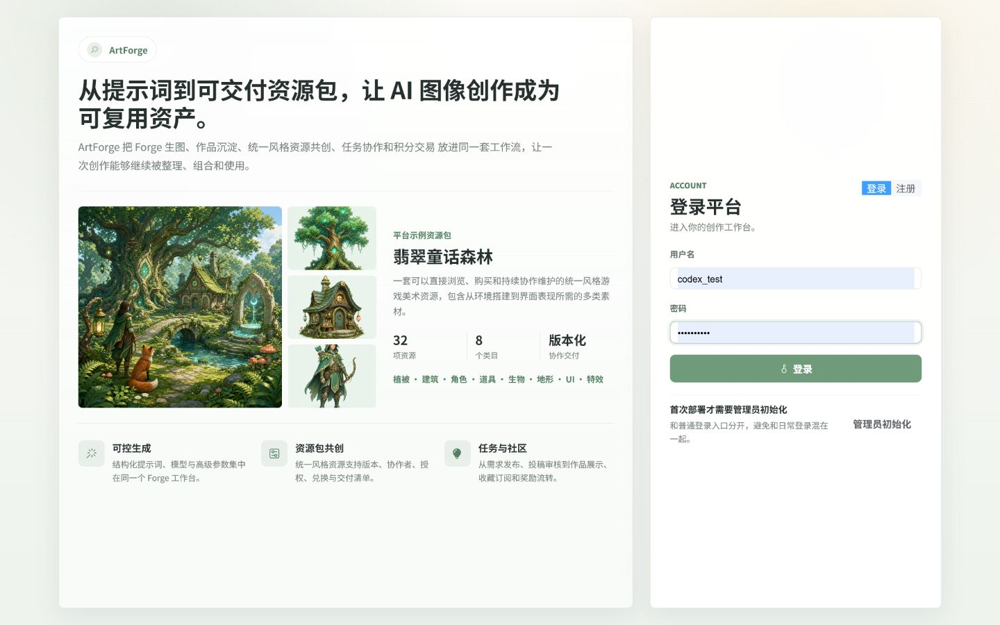

# ArtForge

面向 AI 图像创作者的创作、协作与交易平台。ArtForge 将结构化提示词、生图工作台、作品管理、风格资源包、任务市场和平台运营整合在同一套系统中。

当前仓库是可运行的稳定基线，目标是持续演进为真实可用的平台，而不是论文演示项目。

## 界面预览

### 创作工作台



### 作品广场


### 风格资源市场



### 任务市场



<details>
<summary>查看登录页面</summary>



</details>

## 核心能力

- **生图工作台**：对接 Forge / Stable Diffusion WebUI 兼容 API，支持模型、采样器、尺寸、种子、高清修复等参数。
- **双语提示词库**：按风格、主体、构图、光线、色彩等分类选择标签，展示中文释义和多场景预览图。
- **作品管理**：保存生成结果、正负向提示词、参数和标签，提供个人作品库与公开作品广场。
- **风格资源包**：像游戏引擎资源包一样组织统一风格的植被、建筑、角色、道具、地形、UI 与特效资源，支持不可变资源修订、版本锁定、授权、协作者、积分兑换和交付清单。
- **效果共创**：资源包仍可接收作品投稿，用于展示真实使用效果、社区评价与风格一致性验证。
- **任务市场**：发布创作需求、按等级与状态浏览任务、投稿作品、审核交付并记录积分流转。
- **社区互动**：作品收藏、内容订阅、站内通知以及公开内容浏览。
- **运营后台**：用户与角色管理、内容审核、平台指标、标签维护、预览图库管理和搜索/组合统计。

## 技术栈

| 层级 | 技术 |
| --- | --- |
| 前端 | Vue 3、Vite 6、Element Plus、Axios、ECharts |
| 后端 | Java 17、Spring Boot 3.2.3、Spring Security、MyBatis-Plus |
| 数据 | MySQL 8、Redis 7 |
| 生图 | Forge / Stable Diffusion WebUI-compatible API |
| 鉴权 | JWT |

## 项目结构

```text
backend/                 Spring Boot API 服务
database/                完整建库脚本与增量迁移
docs/                    安装、路线图与标签图库规划
frontend/                Vue 3 Web 应用
scripts/                 演示数据辅助脚本
```

## 快速开始

### 1. 环境要求

- JDK 17
- Node.js 20.19+ 或 22+
- pnpm
- MySQL 8
- Redis 7
- 启用 API 的 Forge，默认地址为 `http://127.0.0.1:7860`

### 2. 初始化数据库

```powershell
mysql -u root -p < database/schema.sql
```

默认数据库名为 `aiart_codex_platform`。已有数据库按时间顺序执行 `database/migrations/` 中尚未应用的脚本。

本版本新增 `20260721_style_package_resource_assets.sql`，会创建资源修订和版本清单表。MySQL 8.0.44 可重复执行该迁移。

### 3. 配置并启动后端

根据 [.env.example](.env.example) 设置环境变量，至少应配置数据库密码和新的 JWT 密钥。

```powershell
cd backend
.\mvnw.cmd spring-boot:run
```

后端默认运行于 `http://127.0.0.1:8080`。

### 4. 启动前端

```powershell
cd frontend
pnpm install
pnpm dev
```

前端默认运行于 `http://127.0.0.1:5173`。开发服务器会把 `/api` 与 `/uploads` 代理到后端。

### 5. 初始化管理员

首次部署时，在登录页打开“管理员初始化”，创建系统中的第一个管理员账号。系统已有管理员后，该接口会拒绝再次初始化。登录后从右上角头像菜单进入“后台审核”。

### 6. 导入示例资源包

仓库包含一个可选的“翡翠童话森林”示例资源包。先设置 `AIART_IMAGE_API_KEY` 生成或补齐图片，再启动后端运行：

```powershell
python scripts/generate-emerald-fable-pack.py
AIART_EMERALD_PASSWORD='set-a-local-demo-password' node scripts/seed-emerald-fable-pack.mjs
```

生成脚本支持 `AIART_IMAGE_API_BASE`、`AIART_IMAGE_MODEL` 和断点续跑；密钥只从环境变量读取。示例包包含 32 项资源，覆盖植被、建筑、道具、角色、生物、地形、UI 和特效。

## 文档

- [完整安装与配置](docs/SETUP.md)
- [产品路线图](docs/ROADMAP.md)
- [标签图库扩展计划](docs/TAG_LIBRARY_EXPANSION_PLAN.md)
- [版本记录](CHANGELOG.md)

## 验证命令

```powershell
cd backend
.\mvnw.cmd test

cd ..\frontend
pnpm build
```

## 安全与发布说明

- 不要提交真实数据库密码、API Key、JWT 密钥、生成文件或上传目录。
- 生产环境必须替换 `AIART_JWT_SECRET`，并通过反向代理提供 HTTPS。
- 当前 CORS 与本地文件存储策略以本地部署为基线，公网部署前应限制来源并配置持久化对象存储。
- 项目代码按 [MIT License](LICENSE) 开源。部署者仍需自行确认所使用模型、LoRA、生成图片与第三方素材的授权范围。

## 当前状态

`v1.4.0` 将风格包升级为可交付、可购买、可版本化的风格资源包。核心业务链路已经可用，后续重点是自动化测试、批量上传、对象存储和真实运营数据验证。
